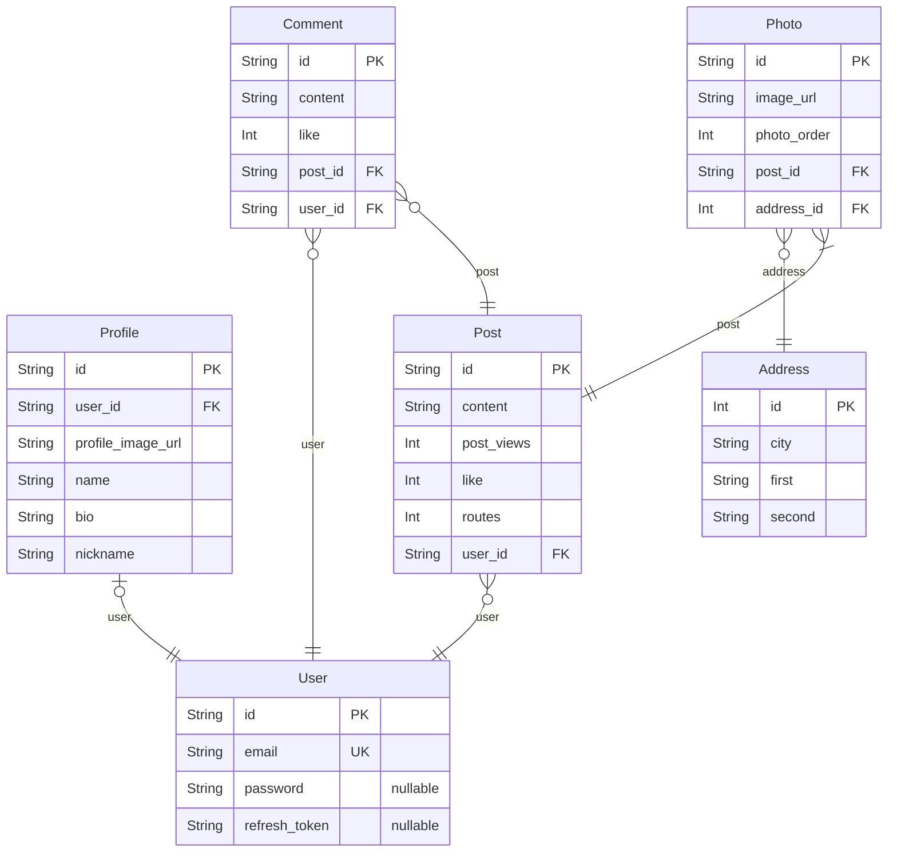

# PROJECT
> Generated by [`prisma-markdown`](https://github.com/samchon/prisma-markdown)

- [Article](#Article)

## Article

### `User`
사용자
RooTrip ( 일명 루트트립 ) 을 사용하는 고객이다.
Social Login 과 Local Login 을 통해서 로그인을 할 수 있다.
로그인 후 , 댓글 과 게시글 작성을 할 수 있다.
Profiel Model 과 1:1 관계
Post Model , Comment Model 과 1:N 관계를 가지고 있다.

**Properties**
  - `id`: 
  - `email`: 사용자의 Email 주소
  - `password`: 사용자의 비밀번호
  - `refresh_token`: 사용자의 재발급 토큰

### `Profile`
프로필
사용자를 생성할 때 , 같이 만들어지는 Profile 이다.
차후
자기소개 , 프로필 이미지 변경 , 닉네임 변경이 가능하다.
User Model 과 1:1 관계이다.

**Properties**
  - `id`: 
  - `user_id`: 유저의 Key [User.id](#User)
  - `profile_image_url`: 프로필 이미지 경로
  - `name`: 사용자의 이름
  - `bio`: 사용자의 자기소개
  - `nickname`: 사용자의 닉네임

### `Post`
게시글
사용자가 작성하는 게시글이다.
내용과 사진을 업로드 한 후 , 작성한다.
사진은 최소한 하나가 있어야 한다.
User Model 과 N:1 관계이다.
Photo Model 과 1:N 관계이다.

**Properties**
  - `id`: 
  - `content`: 게시글 내용
  - `post_views`: 게시글 조회수
  - `like`: 게시글 좋아요 개수
  - `routes`
    > 경로의 순서들
    > 해당 Column은 추가 여부를 고려하고 있는 중
    > 불필요할수도 있다고 판단하기 때문 ( 2023.12.05 )
  - `user_id`: 유저의 Key [User.id](#User)

### `Comment`
게시글의 댓글
사용자가 게시글 내에 작성한 댓글이다.
댓글에는 공백이 들어올 수 없다.
Post , User Model 과 N:1 관계이다.

**Properties**
  - `id`: 
  - `content`: 댓글 내용
  - `like`: 댓글 좋아요 수
  - `post_id`: 게시글의 Key [Post.id](#Post)
  - `user_id`: 유저의 key [User.id](#User)

### `Address`
도로명 주소
사진의 메타정보를 반환하기 위해 미리 저장 해놓는 데이터
차후 , MongoDB 로 이동될 수도 있음! ( 2023.12.05 )
Photo Model 과 1:N 관계이다.

**Properties**
  - `id`: 
  - `city`: 대한민국의 9기의 도 & 시를 표시 ( 경상북도 , 대구 광역시 ...)
  - `first`: 대한민국의 구 & 군을 표시 ( 달서구 , 강동구 ...)
  - `second`: 동 & 면 & 가 를 표시 ( 둔촌동 , 서면 , 종로1가 ...)

### `Photo`
사진
게시글에 저장된 사진
메타정보는 무조건 들어가야 한다.
Post , User Model 과 N:1 관계이다.

**Properties**
  - `id`: 
  - `image_url`: 사진 이미지의 경로
  - `photo_order`: 게시글에서 해당 사진의 순서
  - `post_id`: 게시글의 Key [Post.id](#Post)
  - `address_id`: 주소의 Key [Address.id](#Address)